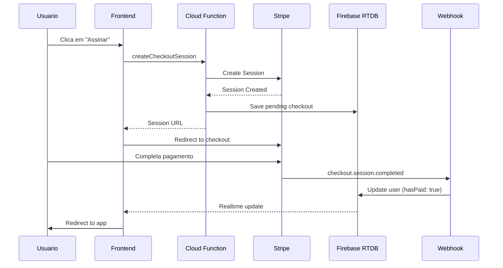

# 🚀 Guia de Integração com Stripe - Sistema IRPF

## 📋 Sumário

- [Visão Geral](#visão-geral)
- [Arquitetura](#arquitetura)
- [Configuração Inicial](#configuração-inicial)
- [Como Funciona](#como-funciona)
- [Cloud Functions](#cloud-functions)
- [Frontend](#frontend)
- [Webhooks](#webhooks)
- [Gerenciamento de Assinaturas](#gerenciamento-de-assinaturas)
- [Testes](#testes)
- [Troubleshooting](#troubleshooting)

---

## 🎯 Visão Geral

Esta integração fornece um sistema completo e robusto de pagamentos recorrentes usando Stripe, com as seguintes funcionalidades:

### ✨ Funcionalidades

- ✅ **Checkout Session** - Sistema de checkout hospedado pelo Stripe
- ✅ **Payment Links** - Links de pagamento diretos (método alternativo)
- ✅ **Webhooks** - Sincronização automática de eventos
- ✅ **Customer Portal** - Portal de autoatendimento para clientes
- ✅ **Gerenciamento de Assinaturas** - Cancelar, reativar, atualizar
- ✅ **Tratamento de Erros** - Sistema robusto com retry logic
- ✅ **Logs Estruturados** - Rastreamento completo de eventos
- ✅ **Realtime Updates** - Sincronização em tempo real com Firebase

---

## 🏗️ Arquitetura

```
┌─────────────────┐
│   Frontend      │
│  (checkout.js)  │
└────────┬────────┘
         │
         ▼
┌─────────────────────────────────────┐
│      Cloud Functions                │
│  ┌──────────────────────────────┐   │
│  │ createCheckoutSession        │   │
│  │ stripeWebhook               │   │
│  │ createPortalSession         │   │
│  │ getSubscriptionStatus       │   │
│  │ cancelSubscription          │   │
│  └──────────────────────────────┘   │
│              │                       │
│              ▼                       │
│  ┌──────────────────────────────┐   │
│  │  stripe-service.js           │   │
│  │  - StripeCustomerService     │   │
│  │  - CheckoutSessionService    │   │
│  │  - SubscriptionService       │   │
│  │  - WebhookProcessor          │   │
│  └──────────────────────────────┘   │
└─────────────────────────────────────┘
         │
         ▼
┌─────────────────┐      ┌─────────────────┐
│  Stripe API     │      │ Firebase RTDB   │
└─────────────────┘      └─────────────────┘
```

---

## ⚙️ Configuração Inicial

### 1️⃣ Configurar Stripe

1. Acesse [Stripe Dashboard](https://dashboard.stripe.com/)
2. Copie suas chaves de API (teste e produção)
3. Crie um produto e um preço recorrente
4. Configure o Customer Portal em Settings → Billing → Customer Portal

### 2️⃣ Configurar Firebase

```javascript
// firebase-config.js
export const stripeConfig = {
  publishableKey: "pk_test_...", // Sua chave pública
  priceId: "price_...",           // ID do preço no Stripe
  productId: "prod_...",          // ID do produto no Stripe
  paymentLink: "https://buy.stripe.com/..." // Payment Link (opcional)
};
```

### 3️⃣ Configurar Variáveis de Ambiente

```bash
cd functions
firebase functions:config:set \
  stripe.secret_key="sk_test_..." \
  stripe.webhook_secret="whsec_..." \
  stripe.price_id="price_..."
```

### 4️⃣ Deploy das Functions

```bash
cd functions
npm install
firebase deploy --only functions
```

### 5️⃣ Configurar Webhook no Stripe

1. Vá em Developers → Webhooks no Stripe Dashboard
2. Adicione endpoint: `https://YOUR_PROJECT.cloudfunctions.net/stripeWebhook`
3. Selecione eventos:
   - `checkout.session.completed`
   - `customer.subscription.created`
   - `customer.subscription.updated`
   - `customer.subscription.deleted`
   - `invoice.payment_succeeded`
   - `invoice.payment_failed`
4. Copie o webhook secret e configure nas variáveis de ambiente

---

## 🔄 Como Funciona

### Fluxo de Checkout



### Processamento de Webhook

1. **Stripe envia evento** → Cloud Function `stripeWebhook`
2. **Validação de assinatura** → `WebhookProcessor.constructEvent()`
3. **Processamento** → Handler específico para cada tipo de evento
4. **Atualização do banco** → Firebase Realtime Database
5. **Logging** → Registro estruturado em `webhookLogs/`

---

## 📡 Cloud Functions

### createCheckoutSession

Cria uma sessão de checkout do Stripe.

**Endpoint:** `POST /createCheckoutSession`

**Body:**
```json
{
  "userId": "firebase-uid",
  "userEmail": "user@example.com",
  "userName": "Nome do Usuário",
  "priceId": "price_..." // opcional
}
```

**Response:**
```json
{
  "success": true,
  "sessionId": "cs_...",
  "url": "https://checkout.stripe.com/..."
}
```

### createPortalSession

Cria sessão do Customer Portal.

**Endpoint:** `POST /createPortalSession`

**Body:**
```json
{
  "userId": "firebase-uid"
}
```

**Response:**
```json
{
  "success": true,
  "url": "https://billing.stripe.com/..."
}
```

### getSubscriptionStatus

Retorna status detalhado da assinatura.

**Endpoint:** `GET /getSubscriptionStatus?userId=XXXX`

**Response:**
```json
{
  "success": true,
  "user": {
    "hasPaid": true,
    "subscriptionStatus": "active",
    "subscriptionId": "sub_...",
    "stripeCustomerId": "cus_..."
  },
  "subscription": {
    "id": "sub_...",
    "status": "active",
    "currentPeriodStart": "2025-01-01T00:00:00Z",
    "currentPeriodEnd": "2025-02-01T00:00:00Z",
    "cancelAtPeriodEnd": false
  }
}
```

### cancelSubscription

Cancela assinatura do usuário.

**Endpoint:** `POST /cancelSubscription`

**Body:**
```json
{
  "userId": "firebase-uid",
  "immediate": false
}
```

---

## 💻 Frontend

### stripe-helper.js

Helper JavaScript que facilita a integração:

```javascript
import { StripeHelper } from './stripe-helper.js';

const stripeHelper = new StripeHelper();

// Criar checkout
await stripeHelper.redirectToCheckout(userId, email, name);

// Abrir portal
await stripeHelper.redirectToPortal(userId);

// Buscar status
const status = await stripeHelper.getSubscriptionStatus(userId);

// Cancelar
await stripeHelper.cancelSubscription(userId);
```

### Utilidades

```javascript
import { UIManager, Formatter, ErrorHandler } from './stripe-helper.js';

// Mostrar notificação
UIManager.showNotification('Pagamento confirmado!', 'success');

// Loading em botão
UIManager.setButtonLoading(button, true);

// Formatar data
Formatter.formatDate('2025-01-01');

// Formatar moeda
Formatter.formatCurrency(2990); // R$ 29,90

// Badge de status
Formatter.getStatusBadge('active');

// Tratar erro
ErrorHandler.handle(error, 'checkout');
```

---

## 🔔 Webhooks

### Eventos Processados

| Evento | Descrição | Ação |
|--------|-----------|------|
| `checkout.session.completed` | Checkout finalizado | Ativa assinatura do usuário |
| `customer.subscription.created` | Assinatura criada | Registra nova assinatura |
| `customer.subscription.updated` | Assinatura atualizada | Atualiza status |
| `customer.subscription.deleted` | Assinatura cancelada | Desativa acesso |
| `invoice.payment_succeeded` | Pagamento bem-sucedido | Confirma renovação |
| `invoice.payment_failed` | Pagamento falhou | Notifica usuário |

### Estrutura de Dados no Firebase

```javascript
users/{userId}/ {
  email: "user@example.com",
  displayName: "Nome",
  hasPaid: true,
  stripeCustomerId: "cus_...",
  subscriptionId: "sub_...",
  subscriptionStatus: "active",
  currentPeriodStart: "2025-01-01...",
  currentPeriodEnd: "2025-02-01...",
  cancelAtPeriodEnd: false,
  lastPaymentStatus: "paid",
  paidAt: 1234567890,
  updatedAt: 1234567890
}

webhookLogs/{eventId}/ {
  eventType: "checkout.session.completed",
  status: "success",
  metadata: {...},
  processedAt: 1234567890
}
```

---

## 👤 Gerenciamento de Assinaturas

### Página de Conta (account.html)

Permite ao usuário:
- Ver status da assinatura
- Ver próxima data de cobrança
- Acessar Customer Portal
- Cancelar assinatura

### Customer Portal

O Stripe Customer Portal permite:
- Atualizar método de pagamento
- Ver histórico de faturas
- Baixar recibos
- Cancelar/reativar assinatura
- Atualizar informações de cobrança

---

## 🧪 Testes

### Testar em Modo de Teste

Use cartões de teste do Stripe:

| Cartão | Resultado |
|--------|-----------|
| 4242 4242 4242 4242 | Sucesso |
| 4000 0000 0000 0002 | Falha (cartão recusado) |
| 4000 0025 0000 3155 | Requer autenticação 3D Secure |

### Testar Webhooks Localmente

```bash
# Instalar Stripe CLI
stripe login

# Escutar webhooks
stripe listen --forward-to localhost:5000/YOUR_PROJECT/us-central1/stripeWebhook

# Disparar evento de teste
stripe trigger checkout.session.completed
```

### Logs

Todos os eventos são logados em formato JSON:

```javascript
{
  timestamp: "2025-01-08T10:00:00.000Z",
  level: "INFO",
  message: "Checkout completado com sucesso",
  userId: "...",
  sessionId: "..."
}
```

---

## 🔧 Troubleshooting

### Erro: "Webhook signature verification failed"

**Causa:** Webhook secret incorreto ou evento não autêntico.

**Solução:**
1. Verifique o webhook secret em `firebase functions:config:get`
2. Reconfigure com o secret correto do Stripe Dashboard
3. Redeploy: `firebase deploy --only functions`

### Erro: "Customer not found"

**Causa:** Usuário não tem `stripeCustomerId` no banco.

**Solução:** O customer é criado automaticamente no primeiro checkout. Certifique-se de que o webhook está funcionando.

### Pagamento foi feito mas usuário não tem acesso

**Causas possíveis:**
1. Webhook não configurado
2. Webhook secret incorreto
3. Erro no processamento do webhook

**Solução:**
1. Verifique logs da Cloud Function
2. Verifique logs de webhook no Stripe Dashboard
3. Teste webhook manualmente
4. Verifique dados no Firebase RTDB em `users/{userId}`

### Checkout Session expira muito rápido

**Solução:** Sessions do Stripe expiram após 24h por padrão. Isso é normal.

---

## 📊 Monitoramento

### Métricas Importantes

1. **Taxa de conversão de checkout**
   - Sessões criadas vs completadas

2. **Taxa de falha de pagamento**
   - `invoice.payment_failed` / total de tentativas

3. **Taxa de cancelamento**
   - `subscription.deleted` / total de assinaturas

4. **Tempo de processamento de webhook**
   - Verificar logs da Cloud Function

### Alertas Recomendados

- Webhook com taxa de erro > 5%
- Mais de 3 falhas de pagamento seguidas para um usuário
- Aumento súbito em cancelamentos

---

## 🔒 Segurança

### Boas Práticas

✅ **Nunca exponha** a chave secreta (secret key) no frontend
✅ **Sempre valide** assinaturas de webhook
✅ **Use HTTPS** em produção
✅ **Implemente rate limiting** nas Cloud Functions
✅ **Monitore** eventos suspeitos
✅ **Mantenha** bibliotecas atualizadas

### Variáveis de Ambiente

Nunca commit:
- `STRIPE_SECRET_KEY`
- `STRIPE_WEBHOOK_SECRET`

Use:
```bash
firebase functions:config:set stripe.secret_key="..."
```

---

## 📚 Recursos Adicionais

- [Stripe Documentation](https://stripe.com/docs)
- [Stripe API Reference](https://stripe.com/docs/api)
- [Firebase Functions](https://firebase.google.com/docs/functions)
- [Stripe Testing](https://stripe.com/docs/testing)

---

## 🆘 Suporte

Para problemas ou dúvidas:
1. Verifique este guia
2. Consulte logs das Cloud Functions
3. Consulte Stripe Dashboard → Logs
4. Verifique dados no Firebase RTDB

---

**Última atualização:** 2025-01-08
**Versão:** 2.0.0
